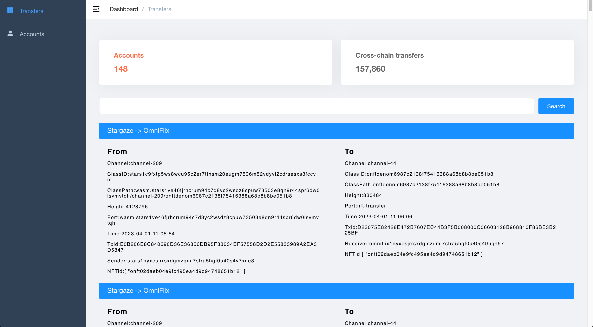

# 1.Phase1 Summary

## Overview

Everyone gained a lot from this phase1 activity, but also found some problems


#### 1.1 Gon's stats

+ dashboard 


```sh
xavior isc721Fan
iaa1ghcwp60uzgylr3kukkppzq457j0tlqw7g3s69u
stars1ghcwp60uzgylr3kukkppzq457j0tlqw7f08kvu
juno1ghcwp60uzgylr3kukkppzq457j0tlqw7tpnsq3
uptick1s4ljp93yg5lpkxr26lwnadkszygj7nwnq7820k
omniflix1ghcwp60uzgylr3kukkppzq457j0tlqw7qdpjsn
```


#### 1.2 benefit from Gon

+ Many people involved
+ Developed many visualization tools
+ + [NFT4good  Dashboard](http://nft4good.xyz/#/transfers)
+ + [NFTland  Explorer](http://www.nftland.org)
+ + [More](https://github.com/game-of-nfts/gon-evidence/issues?q=AWARD+Claim+2)
+ found a lot of bugs
+ + [only accepts alphanumeric characters #368(uppercase letter not supported)](https://github.com/game-of-nfts/gon-evidence/issues/368)
+ + [More](https://github.com/game-of-nfts/gon-evidence/issues?q=bug)

#### 1.3 Problems with Gon

+ There are many participants but not many people complete the task
+ + [Score Card](https://interchainnfts.dev/gon/scorecard.html)
+ Insufficient stability of chains such as wasm chain
+ + Nft stuck on wasm chain（ex stargaze <=> juno）
